<picture>
  <source media="(prefers-color-scheme: dark)" srcset="assets/header-dark.svg">
  
</picture>

  <picture>
    <source media="(prefers-color-scheme: dark)"
            srcset="https://readme-typing-svg.demolab.com?font=VT323&size=28&duration=3000&pause=800&color=C9A227&center=true&vCenter=true&width=750&lines=%E2%9A%94%EF%B8%8F+Machine+Learning+Engineer+%C2%B7+Researcher%3B%F0%9F%A7%AC+PhD+%C2%B7+Deep+Learning+for+Medical+Imaging%3B%F0%9F%94%AE+Computer+Vision+%26+NLP+Sorceress%3B%E2%98%81%EF%B8%8F+Cloud-Native+Architect+on+Azure+%26+AWS%3B%E2%9C%8D%EF%B8%8F+Chronicler+%C2%B7+Technical+Scribe%3B%F0%9F%8F%86+NIH+Codeathon+Champion+(x2)%3B%F0%9F%93%B7+Landscape+Cartographer">
    
  </picture>

---

### 📜 Character Lore

*In the realm where machines learn to see and clouds never sleep, there lives an engineer*
*who builds things that hold up under pressure — production systems, research pipelines,*
*and the occasional argument that deep learning can do that, actually.*

*She moves between industry and research the way most people move between tabs,*
*backed by a PhD that sharpened her instincts and a career that put them to work.*
*She speaks fluently in both Python and plain English, transforms the arcane into the obvious through the written word, and collects new latitudes*
*the way others collect achievements.* 

*Currently: building AI that keeps the world a little safer. Always: curious.*

---

## ⚔️ Character Stats

  <picture>
    <source media="(prefers-color-scheme: dark)"
            srcset="https://github-readme-stats-nine-navy-58.vercel.app/api?username=savindi-wijenayaka&show_icons=true&count_private=true&include_all_commits=true&hide_border=true&bg_color=0d1117&title_color=c9a227&icon_color=7c3aed&text_color=f0e6d3&ring_color=7c3aed">
    
  </picture>
  <picture>
    <source media="(prefers-color-scheme: dark)"
            srcset="https://github-readme-stats-nine-navy-58.vercel.app/api/top-langs/?username=savindi-wijenayaka&layout=compact&langs_count=8&hide_border=true&bg_color=0d1117&title_color=c9a227&text_color=f0e6d3">
    
  </picture>

 

## 🔥 Combo Meter

  <picture>
    <source media="(prefers-color-scheme: dark)"
            srcset="https://streak-stats.demolab.com?user=savindi-wijenayaka&theme=tokyonight&hide_border=true&background=0d1117&ring=c9a227&fire=ff6b35&currStreakLabel=c9a227&sideLabels=a78bfa&dates=f0e6d3">
    
  </picture>

 

## 🧙 Spellbook & Equipment

*Mastered arts and equipped artefacts of the ML Mage:*

**⚔️ The Craft**

  <picture>
    <source media="(prefers-color-scheme: dark)" srcset="https://skillicons.dev/icons?i=python,pytorch,opencv,fastapi,git&theme=dark">
    
  </picture>

**☁️ The Infrastructure**

  <picture>
    <source media="(prefers-color-scheme: dark)" srcset="https://skillicons.dev/icons?i=azure,aws,docker,kubernetes,githubactions&theme=dark">
    
  </picture>

**🔬 Specialist Tools**

 

## 🏆 Trophy Room

| Loot | Quest | Year |
|------|-------|------|
| 🥇 1st Place — SPARC FAIR Codeathon | NIH · University of Auckland | 2022 |
| 🥈 2nd Place — SPARC FAIR Codeathon | NIH · University of Auckland | 2024 |
| 🎖️ 4th Place — DataStorm Datathon | Octave (JKH) · University of Moratuwa | 2020 |
| 🥈 1st Runner-Up — National Youth Software Competition | UNDP Sri Lanka | 2017 |
| 🎓 First Class Honours · GPA 3.96 / 4.00 | University of Kelaniya | 2020 |
| 📜 Dean's List Honouree | University of Kelaniya — all four years | 2016–2020 |

 

## 📖 Chronicles — Latest Scrolls from the Archives

> *The Chronicler records her findings across all realms of computation...*

<!-- BLOG-POST-LIST:START -->
<!-- BLOG-POST-LIST:END -->

 

## 🎓 Guild Contributions

- 🏛️ **Teaching Team** — [Code In Place 2021](https://codeinplace.stanford.edu/), Stanford University · *Python education for global learners*
- 🎙️ **Guest Speaker** — IEEE & DeepLearning.AI technical webinars · *Deep learning for broad audiences*
- ✍️ **Technical Scribe** — [Medium](https://savindi-wijenayaka.medium.com) · *CNNs, Kubernetes, Docker, Azure, GitHub Actions*

 

## 🌐 Portals to Other Realms

 

### 🐍 The Snake That Ate My Commits

<picture>
  <source media="(prefers-color-scheme: dark)" srcset="assets/github-snake-dark.svg">
  
</picture>

<picture>
  <source media="(prefers-color-scheme: dark)"
          srcset="https://capsule-render.vercel.app/api?type=waving&color=7c3aed&height=100&section=footer">
  
</picture>
